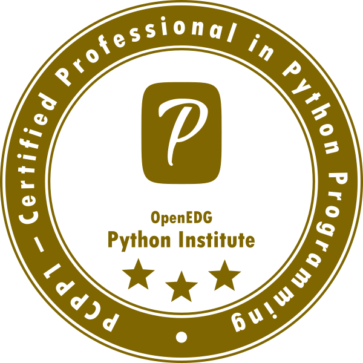
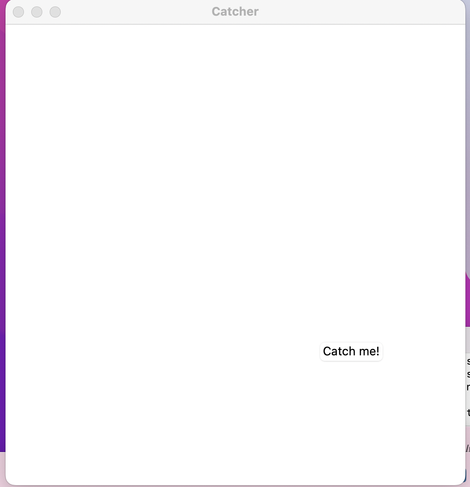
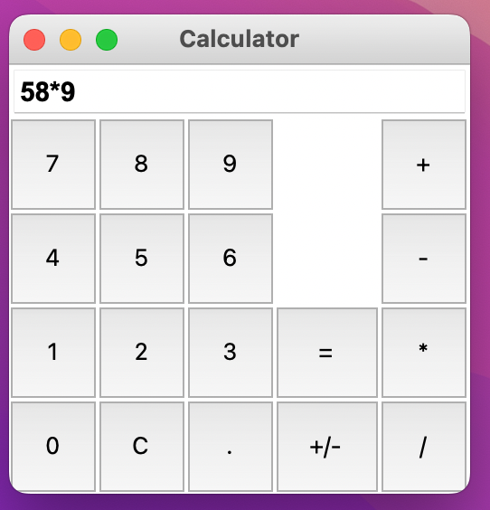

# Certified Professional in Python Programming 1 (PCPP1) 's Exercises

## Motivation

Took the certification as I was curious what a professional certification questions and exams looks like. Used 25 days to prepare for the certification, gave exam and got <a href="https://www.credly.com/badges/ede31d27-3a19-420e-ab4e-8bb6b27ba9e4">certified</a>. 

<a href="https://dkhambu.medium.com/pcpp1-python-professional-certification-exam-e8f0d90ff903">This</a> is a medium article on what I felt about it if you too are testing the water. 

## Outcome
At the end of completing this course, I felt like I time travelled back to the freshman and sophomore year of my college. Especially the GUI applications!, both tkinter and in college used `c++` too! <b>Yahtzee game</b> is still fresh. 

## Directory Structure
The exercises are based on topics covered in the <a href="https://edube.org/">course</a>.

Command to run the programs:

`python <exercise-name>.py` 

## GUI's looks

Here are the screen shots of the GUI programs: 

1. simple calculator 

2. catch me 

3. clicker 

4. Traffic lights 

5. tic-tac-toe 

6. full calculator 

## Two Cents
That's it! I hope this repository will be helpful to those who need help with the exercises! 

Happy coding!
